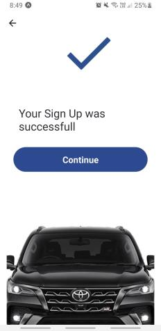

# Guía de usuario para la aplicación Fiuumber
## 1.Inicio de la aplicación
Al abrir la aplicación por primera vez se observa la pantalla inicial, con un botón “Let’s Go”.  

Al presionar el botón, se redirecciona a la pantalla de Inicio de Sesión y Registro. En esta pantalla se muestran dos botones: “Sign In” para ingresar en una cuenta ya existente (sea de pasajero o de conductor), y “Sign Up” para crear una nueva cuenta.

### Registro
Al presionar el botón de “Sign Up”, se redirige a la primera pantalla de carga de los datos del nuevo usuario. En ella, se pueden observar diferentes opciones de creación de cuenta: manualmente o con Google. 

#### Carga de datos del usuario

Para registrarse manualmente, se deben llenar los campos que aparecen en pantalla: nombre, apellido, correo electrónico, contraseña y nuevamente la contraseña. Posteriormente, se debe presionar el botón “Next” para continuar con el registro. 
Para cargar los datos del usuario a través de Google, se debe presionar el botón “Sign up with Google”.

#### Selección de rol

Sin importar que los datos principales del nuevo usuario hayan sido cargados manualmente o a través de Google, una vez cargados se continúa a la pantalla de selección de rol. En esta, podemos observar dos botones con dos opciones: “I’m a passenger” o “I’m a driver”. En caso de que la persona que está registrándose quiera que su rol en Fiuumber sea el de pasajero, deberá apretar el primer botón. En caso de que desee ser un conductor, deberá apretar el segundo botón. 

En caso de haberse seleccionado la opción “I’m a driver”, se redirige a una pantalla en la que deben cargarse los datos del vehículo que conducirá este chofer. Después de haber ingresado todos estos datos, debe presionarse el botón “Next”, y si la información indicada es válida, se redirigirá al chofer a la pantalla de confirmación de éxito en la creación de la cuenta.

En caso de haberse seleccionado la opción “I’m a passenger”, se redirige al pasajero a la pantalla de confirmación de éxito en la creación de la cuenta. 

Una vez mostrada la pantalla de confirmación de éxito en la creación de la cuenta, se puede presionar el botón “Continue” para redirigir al usuario a iniciar sesión en su nueva cuenta y empezar a usar la aplicación.

## Inicio de sesión
Para iniciar sesión, un usuario puede ingresar con su correo electrónico o contraseña y presionar el botón “Log In”, o ingresar sus datos con Google (en el caso de que su cuenta haya sido creada de esa forma). Si alguno de los datos es ingresado incorrectamente, se mostrará un mensaje de error y no dejará al usuario iniciar sesión en la aplicación.

En el caso de que los datos ingresados correspondan a la cuenta de un pasajero, se redirigirá al usuario a la pantalla de Home para pasajeros. En caso contrario, se redirigirá al usuario a la pantalla de Home para conductores. 

## 2.Uso de la aplicación de pasajeros

Una vez ingresado en la aplicación, el pasajero podrá observar la pantalla de Home, con un mapa con la ubicación actual y un botón para refrescar la pantalla en búsqueda de choferes. En la parte superior izquierda de la pantalla presenta un menú con más opciones (tres rayas).

### Nuevo viaje

En la pantalla Home se encuentra un drop up menu con la opción de ingresar origen y destino de nuestro viaje.}

 

Al ingresar los datos de nuestro viaje, Fiuumber calcula la tarifa en función de múltiples variables como el horario, la distancia, la duración y datos del pasajero y el conductor. 

Ya calculada la tarifa, con el botón “Get your Fiuumber!” damos inicio a la espera por un chofer. En esta instancia tenemos la opción de cancelar el viaje pedido, en caso de arrepentirse o que la espera sea excesiva.

Finalizada la espera, llega una notificación dando aviso de que nuestro conductor se encuentra en camino hacia la ubicación indicada como punto de origen de viaje. En pantalla se indican los datos del chofer asignado y de su vehículo, junto a su puntaje en la aplicación y cantidad de viajes realizados.

En pantalla figuran el camino a realizarse, y la ubicación actual del chofer (punto verde) en camino a buscar al pasajero.

Una vez que llega el chofer, notifica a través de un modal que el pasajero debe apresurarse para arrancar el viaje.

A lo largo del viaje se actualiza la ubicación hasta llegar a destino.

Finalizado el viaje, aparece un modal en pantalla dando la posibilidad de puntuar al chofer y escribir una nota al mismo. Además da la opción de reportarlo en caso de insatisfacción con su servicio.

### Más opciones para el pasajero
Estas opciones permiten la visualización de nuestro perfil, el historial de nuestros viajes, y nuestras transacciones como pasajero. Por último, da la opción de cerrar sesión.

	
#### Visualización del perfil propio
Al presionar la opción “My Profile”, se redirige al pasajero a la pantalla de su propio perfil. En ésta, puede observar toda su información: 

También da la opción de modificar los datos y cambiar la contraseña.

#### Visualización del historial de viajes
Al presionar la opción “My trips”, se redirige al pasajero a la pantalla con un listado de sus viajes:

El mismo presenta el número de identificación de los pasajeros llevados, junto al nuestro. Además muestra los puntos de origen y destino de cada viaje, el horario, status y precio final.

#### Visualización y manejo de transacciones 

Al presionar la opción “My balance”, se puede observar el saldo actual del usuario logueado junto a sus transacciones. Además, puede depositar y extraer dinero.

## 3.Uso de la aplicación de conductores

La pantalla Home muestra el mapa y pone en espera de un pasajero. Además, en la parte superior izquierda de la pantalla presenta un menú con más opciones (tres rayas).

### Nuevo viaje

Finalizada la espera, un modal con un nuevo posible viaje aparece en pantalla, y con el mismo  llega una notificación. El mismo indica el precio y nombre del pasajero que quiere viajar, dando la opción de tomar el viaje o darlo de baja y quedar en espera de otro. 

Una vez aceptado, se indicando el camino hacia el punto de encuentro con el pasajero, comunicando el destino y dando la opción de cancelarlo. 

El botón “I Arrived!” notifica al pasajero que el chofer ha llegado a buscarlo. Ya en el punto de encuentro, el botón da la opción de inicio de viaje.

Luego, se traza el camino de origen a destino.

### Más opciones
Estas opciones permiten la visualización de nuestro perfil, el historial de nuestros viajes, y nuestras transacciones como chofer. Por último, da la opción de cerrar sesión.
	
#### Visualización del perfil propio
Al presionar la opción “My Profile”, se redirige al chofer a la pantalla de su propio perfil. En ésta, puede observar toda su información: 

También da la opción de modificar los datos y cambiar la contraseña.

#### Visualización del historial de viajes
Al presionar la opción “My trips”, se redirige al chofer a la pantalla con un listado de sus viajes:

El mismo presenta el número de identificación de los pasajeros llevados, junto al nuestro. Además muestra los puntos de origen y destino de cada viaje, el horario, status y precio final.

#### Visualización y manejo de transacciones 

Al presionar la opción “My balance”, se puede observar el saldo actual del usuario logueado junto a sus transacciones. Además, puede depositar y extraer dinero.
	

